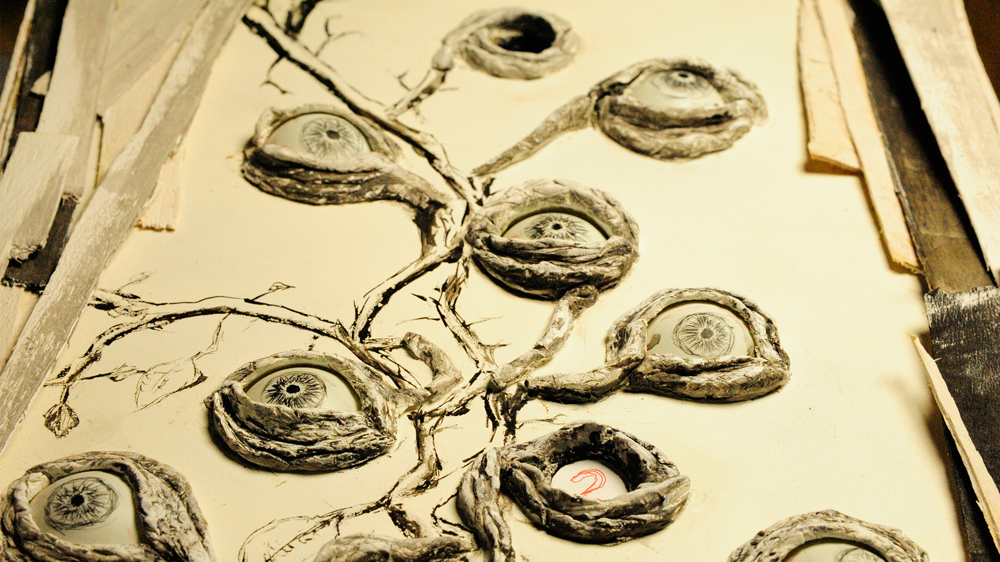
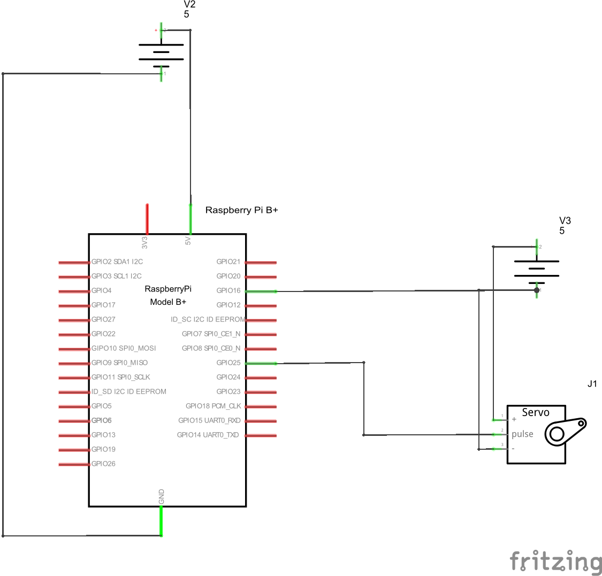

# Readme project_motorPoster_creepyEyes



### The Idea
In this last project in our course i made a "poster", actual more a box than a poster, with a painting on the front side. The painting is a plant with eye-buds. the eyes are table tennis balls. Behind one of the balls is a servo motor, which moves the ball and is controlled by a raspberryPi. There is also a hidden Webcam, this is the input for the facetracking script running on the raspberry, which gives the controllsignal to the servo. What happens is that this none eye is following you left and right when you move. A little creepy, isn't it?

### Prerequisite

For the Hardware you will need the following parts:
+ RaspberryPi b+
+ USB power supply plus usb cable
+ Servo Motor
+ Power supply for the servo motor
+ A Raspberry Pi supported Webcam (I used a PlayStation PSEye Cam)
+ Cables
+ Wood panel
+ "Keramiplast" modeling clay
+ A bunch of table tennis balls
+ Acryl color, smaller pieces of wood, stuff for "decorating"
+ Monitor and keyboard


### Dependencies

Setup the RaspberryPi:
1. Setup RaspberryPi Operation System, using [this](https://www.raspberrypi.org/documentation/installation/noobs.md) instruction
2. Install [ServoBlaster](https://github.com/richardghirst/PiBits/tree/master/ServoBlaster) Driver, support for the Servo motor
3. Install Raspberry Webcam Driver using the following
```
sudo apt-get install fswebcam
```
4. Install the RPIO library on Raspberry Pi using the following

  ```
  sudo apt-get install python-setuptools
sudo easy_install -U RPIO```

5. Copy the facetrack.py file into the raspberry home folder
6. Copy the
7. Wire the cables using this circuit diagram below
8. Plug USB webcam in USB port





### Usage

1. Start Raspberry Pi and log in
2. Run the facetrack script with

  `sudo python facetrack.py`

3. Now the Raspberry is tracking your face and the eye follows your movements.
4. enjoy !


### Contact

If you want to contact me, write me an email at barockjunge@gmail.com.

### Licence
 The MIT License (MIT)

Copyright (c) [2015] [Lukas Schmidt-Wiegand]

Permission is hereby granted, free of charge, to any person obtaining a copy
of this software and associated documentation files (the "Software"), to deal
in the Software without restriction, including without limitation the rights
to use, copy, modify, merge, publish, distribute, sublicense, and/or sell
copies of the Software, and to permit persons to whom the Software is
furnished to do so, subject to the following conditions:

The above copyright notice and this permission notice shall be included in all
copies or substantial portions of the Software.

THE SOFTWARE IS PROVIDED "AS IS", WITHOUT WARRANTY OF ANY KIND, EXPRESS OR
IMPLIED, INCLUDING BUT NOT LIMITED TO THE WARRANTIES OF MERCHANTABILITY,
FITNESS FOR A PARTICULAR PURPOSE AND NONINFRINGEMENT. IN NO EVENT SHALL THE
AUTHORS OR COPYRIGHT HOLDERS BE LIABLE FOR ANY CLAIM, DAMAGES OR OTHER
LIABILITY, WHETHER IN AN ACTION OF CONTRACT, TORT OR OTHERWISE, ARISING FROM,
OUT OF OR IN CONNECTION WITH THE SOFTWARE OR THE USE OR OTHER DEALINGS IN THE
SOFTWARE.